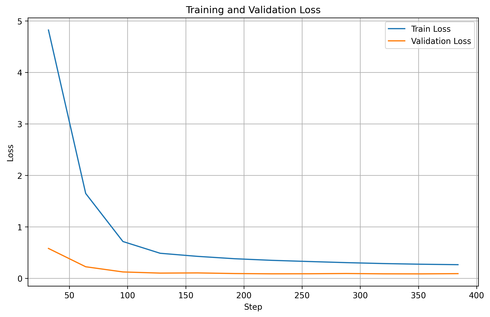

# Biomedical Extraction Pipeline

A lightweight biomedical NLP project for entity extraction, relation mining, and model experimentation.

## Project overview

This repository organizes reusable code, notebooks, datasets, and results for building a biomedical extraction pipeline. It focuses on:

- preparing and flattening biomedical NER datasets,
- fine-tuning transformer-based entity extraction models with adapters and LoRA,
- evaluating model performance and iterating on workflow components.

## Contents

```text
.
├── data/
│   └── processed/
│       └── bc5cdr_flattened_hf/
├── evals/
│   ├── images/
│   └── tables/
├── logs/
├── notebooks/
│   ├── 01_data_prep.ipynb
│   ├── 02_ner_training.ipynb
│   ├── 03_weak_supervision.ipynb
│   ├── 04_re_training.ipynb
│   └── 05_pipeline_eval_xai.ipynb
├── requirements/
│   ├── 00_core.txt
│   ├── 01_data_prep.txt
│   ├── 02_ner_training.txt
│   ├── 03_weak_supervision.txt
│   ├── 04_re_training.txt
│   └── 05_pipeline_eval_xai.txt
├── results/
├── snapshots/
├── src/
│   ├── config.py
│   ├── utils.py
│   ├── data_utils/
│   ├── model_utils/
│   └── __init__.py
├── trainer_output/
├── README.md
└── LICENSE
```

A quick overview of the main folders and key files for this project.

## Getting started

1. Create a Python environment.
2. Install dependencies from `requirements/00_core.txt` and any stage-specific requirements as needed.
3. Use the notebooks in `notebooks/` to run data preparation, training, and evaluation.

## Notebook Guides

### Notebook 01: Data Preparation (`notebooks/01_data_prep.ipynb`)

This notebook handles data loading and preprocessing for the biomedical extraction pipeline.

**Dataset:** [bigbio/BC5CDR](https://huggingface.co/datasets/bigbio/bc5cdr)
- **Description:** BC5CDR (BioCreative V Chemical Disease Relation) is a benchmark biomedical dataset containing PubMed abstracts annotated with chemical and disease entities, as well as their relationships.
- **Task:** Named Entity Recognition (NER) for Chemical and Disease entities in biomedical text
- **Splits:** Train, Validation, Test
- **Annotations:** BIO-tagged entity labels (B-Chemical, I-Chemical, B-Disease, I-Disease, O)

**Key Steps:**
1. Load the BC5CDR dataset from Hugging Face (`bigbio/bc5cdr`)
2. Ensure proper train/validation/test splits
3. Flatten nested dataset structure for token classification
4. Save processed dataset to `data/processed/bc5cdr_flattened_hf/`

**Output:** Flattened HuggingFace Arrow datasets ready for model training

---

### Notebook 02: NER Training (`notebooks/02_ner_training.ipynb`)

This notebook fine-tunes a biomedical BERT model for Named Entity Recognition using LoRA (Low-Rank Adaptation).

**Base Model:** [microsoft/BiomedNLP-BiomedBERT-base-uncased-abstract](https://huggingface.co/microsoft/BiomedNLP-BiomedBERT-base-uncased-abstract)

#### Training Configuration

**Model & LoRA Setup:**
```python
peft_config = LoraConfig(
    task_type=TaskType.TOKEN_CLS,
    r=16,
    lora_alpha=32,
    lora_dropout=0.1,
    target_modules=["query", "value"],
)
```

**Training Hyperparameters:**
```python
training_args = TrainingArguments(
    num_train_epochs=20,
    bf16=torch.cuda.is_bf16_supported(),
    fp16=not torch.cuda.is_bf16_supported(),
    per_device_train_batch_size=4,
    per_device_eval_batch_size=4,
    gradient_accumulation_steps=4,
    eval_accumulation_steps=4,
    weight_decay=0.01,
    warmup_steps=20,
    lr_scheduler_type="linear",
    seed=42,
    learning_rate=2e-4,
    eval_strategy="epoch",
    save_strategy="epoch",
    logging_strategy="epoch",
    load_best_model_at_end=True,
    metric_for_best_model="f1",
    greater_is_better=True,
    save_total_limit=1,
    ...
)
```

**Evaluation Strategy:** Per epoch
- Metrics: Precision, Recall, F1, Accuracy
- Best Model Selection: F1 score

#### Training Results

| Epoch | Train Loss | Val Loss | Precision | Recall | F1     | Accuracy |
|:-----:|:----------:|:--------:|:---------:|:------:|:------:|:--------:|
| 1.0   | 4.8229     | 0.5813   | 0.0000    | 0.0000 | 0.0000 | 0.8512   |
| 2.0   | 1.6490     | 0.2256   | 0.6473    | 0.7036 | 0.6743 | 0.9412   |
| 3.0   | 0.7159     | 0.1249   | 0.7722    | 0.8330 | 0.8014 | 0.9623   |
| 4.0   | 0.4875     | 0.1023   | 0.8300    | 0.8143 | 0.8221 | 0.9662   |
| 5.0   | 0.4277     | 0.1060   | 0.7734    | 0.8805 | 0.8235 | 0.9641   |
| 6.0   | 0.3815     | 0.0938   | 0.8272    | 0.8455 | 0.8363 | 0.9677   |
| 7.0   | 0.3503     | 0.0884   | 0.8196    | 0.8745 | 0.8462 | 0.9697   |
| 8.0   | 0.3272     | 0.0896   | 0.8205    | 0.8764 | 0.8476 | 0.9696   |
| 9.0   | 0.3057     | 0.0943   | 0.7938    | 0.8897 | 0.8390 | 0.9674   |
| 10.0* | 0.2877     | 0.0882   | 0.8214    | 0.8803 | 0.8498 | 0.9697   |
| 11.0  | 0.2747     | 0.0873   | 0.8202    | 0.8770 | 0.8476 | 0.9697   |
| 12.0  | 0.2659     | 0.0920   | 0.8043    | 0.8868 | 0.8435 | 0.9684   |

*Best model selected at epoch 10

#### Training Visualizations
<details>
<summary>📈 Interactive Training Dashboard (Trackio)</summary>

[Open Full Dashboard](https://Francesco-A-nlp-tracking.hf.space/?project=Biomed-IE&run_ids=24e46632c1b24a9a9a48de8f8e84526b&smoothing=1&sidebar=hidden&navbar=hidden)

<iframe 
  src="https://Francesco-A-nlp-tracking.hf.space/?project=Biomed-IE&run_ids=24e46632c1b24a9a9a48de8f8e84526b&smoothing=1&sidebar=hidden&navbar=hidden" 
  width="100%" 
  height="600" 
  frameborder="0">
</iframe>

</details>

<details>
<summary>📊 Training Loss Curve</summary>



</details>


#### Model Artifacts

**Fine-tuned Model:** [Francesco-A/BiomedNLP-PubMedBERT-base-uncased-ner-abstract-bc5cdr-LoRA-v1.1](https://huggingface.co/Francesco-A/BiomedNLP-PubMedBERT-base-uncased-ner-abstract-bc5cdr-LoRA-v1.1)

The trained adapter weights and tokenizer are stored on Hugging Face Model Hub with full configuration and label mappings.

---
### [WIP] Notebook 03: Weak supervision (`notebooks/03_weak_supervision.ipynb`)

...

---

## Notes

- This is an initial project scaffold and can be extended with additional preprocessing, model training, and evaluation scripts.
- The repository is organized to keep data prep, model utilities, and experiments separated.
