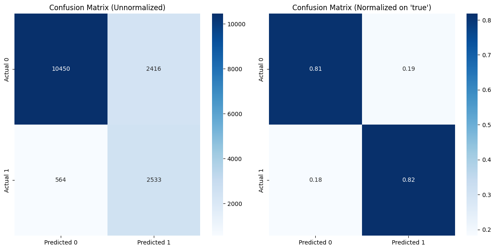
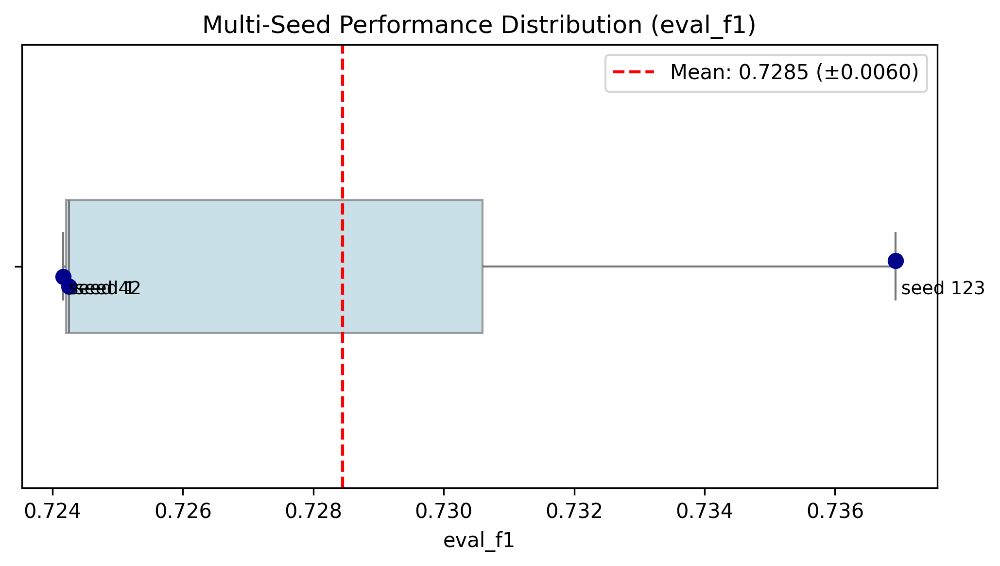

# Biomedical Extraction Pipeline

## Project overview

The core question behind this project is whether relatively compact open LLMs, including 14B-parameter instruct models, can generate useful weak labels for biomedical text data that are strong enough to support downstream relation extraction. Rather than treating the LLM as the final classifier, the project uses it as a weak supervisory signal: it extracts candidate chemical-disease relations, records reasoning traces and weak labels, and then checks whether those labels are informative enough to train a smaller relation-extraction model.

This is intentionally broader than the original BC5CDR binary formulation. The weak-label schema was extended to a four-class setup to capture more clinically meaningful relation types beyond simple presence/absence: no relation, causal induction, treatment/prevention, and antagonism/blocking. In practice, the additional classes are much rarer than the main positive/negative split, so the project explicitly evaluates how much signal remains useful in sparse multiclass settings.

## Contents

```text
.
├── data/
│   ├── checkpoints/
│   └── processed/
├── evals/
│   ├── images/
│   └── tables/
├── logs/
├── notebooks/
│   ├── 01_data_prep.ipynb
│   ├── 02_ner_training.ipynb
│   ├── 03_weak_supervision.ipynb
│   ├── 04_re_eval.ipynb
│   ├── 04_re_training.ipynb
│   ├── 05_pipeline_eval_xai.ipynb
│   └── kaggle/
├── requirements/
│   ├── 00_core.txt
│   ├── 01_data_prep.txt
│   ├── 02_ner_training.txt
│   ├── 03_weak_supervision.txt
│   ├── 04_re_training.txt
│   ├── 05_pipeline_eval_xai.txt
│   └── kaggle/
├── results/
│   ├── ner/
│   └── re/
├── snapshots/
├── src/
│   ├── __init__.py
│   ├── config.py
│   ├── utils.py
│   ├── data_utils/
│   │   └── preprocessing.py
│   ├── evaluation/
│   │   └── diagnostics.py
│   ├── modelling/
│   │   ├── __init__.py
│   │   ├── eval.py
│   │   ├── named_entity_recognition.py
│   │   ├── relation_extraction.py
│   │   └── training.py
│   └── structured_extraction/
│       ├── __init__.py
│       ├── generator.py
│       ├── prompts.py
│       └── pydantic_schema.py
├── trainer_output/
├── .python-version
├── .gitignore
├── README.md
└── LICENSE
```


## Getting started

1. Create a Python environment.
2. Install dependencies from `requirements/00_core.txt` and any stage-specific requirements as needed.
3. Use the notebooks in `notebooks/` to run data preparation, training, and evaluation.

## Notebook Guides

### Notebook 01: Data Preparation (`notebooks/01_data_prep.ipynb`)

This notebook handles data loading and preprocessing for the biomedical extraction pipeline.

**Dataset:** [bigbio/BC5CDR](https://huggingface.co/datasets/bigbio/bc5cdr)
- **Description:** BC5CDR (BioCreative V Chemical Disease Relation) is a benchmark biomedical dataset containing PubMed abstracts annotated with chemical and disease entities, as well as their relationships.
- **Task:** Named Entity Recognition (NER) for Chemical and Disease entities in biomedical text
- **Splits:** Train, Validation, Test
- **Annotations:** BIO-tagged entity labels (B-Chemical, I-Chemical, B-Disease, I-Disease, O)

**Key Steps:**
1. Load the BC5CDR dataset from Hugging Face (`bigbio/bc5cdr`)
2. Ensure proper train/validation/test splits
3. Flatten nested dataset structure for token classification
4. Save processed dataset to `data/processed/bc5cdr_flattened_hf/`

**Output:** Flattened HuggingFace Arrow datasets ready for model training

---

### Notebook 02: NER Training (`notebooks/02_ner_training.ipynb`)

This notebook fine-tunes a biomedical BERT model for Named Entity Recognition using LoRA (Low-Rank Adaptation).

**Base Model:** [microsoft/BiomedNLP-BiomedBERT-base-uncased-abstract](https://huggingface.co/microsoft/BiomedNLP-BiomedBERT-base-uncased-abstract)

#### Training Configuration

**Model & LoRA Setup:**
```python
peft_config = LoraConfig(
    task_type=TaskType.TOKEN_CLS,
    r=16,
    lora_alpha=32,
    lora_dropout=0.1,
    target_modules=["query", "value"],
)
```

**Training Hyperparameters:**
```python
training_args = TrainingArguments(
    num_train_epochs=20,
    bf16=torch.cuda.is_bf16_supported(),
    fp16=not torch.cuda.is_bf16_supported(),
    per_device_train_batch_size=4,
    per_device_eval_batch_size=4,
    gradient_accumulation_steps=4,
    eval_accumulation_steps=4,
    weight_decay=0.01,
    warmup_steps=20,
    lr_scheduler_type="linear",
    seed=42,
    learning_rate=2e-4,
    eval_strategy="epoch",
    save_strategy="epoch",
    logging_strategy="epoch",
    load_best_model_at_end=True,
    metric_for_best_model="f1",
    greater_is_better=True,
    save_total_limit=1,
    ...
)
```

**Evaluation Strategy:** Per epoch
- Metrics: Precision, Recall, F1, Accuracy
- Best Model Selection: F1 score

#### Training Results

| Epoch | Train Loss | Val Loss | Precision | Recall | F1     | Accuracy |
|:-----:|:----------:|:--------:|:---------:|:------:|:------:|:--------:|
| 1.0   | 4.8229     | 0.5813   | 0.0000    | 0.0000 | 0.0000 | 0.8512   |
| 2.0   | 1.6490     | 0.2256   | 0.6473    | 0.7036 | 0.6743 | 0.9412   |
| 3.0   | 0.7159     | 0.1249   | 0.7722    | 0.8330 | 0.8014 | 0.9623   |
| 4.0   | 0.4875     | 0.1023   | 0.8300    | 0.8143 | 0.8221 | 0.9662   |
| 5.0   | 0.4277     | 0.1060   | 0.7734    | 0.8805 | 0.8235 | 0.9641   |
| 6.0   | 0.3815     | 0.0938   | 0.8272    | 0.8455 | 0.8363 | 0.9677   |
| 7.0   | 0.3503     | 0.0884   | 0.8196    | 0.8745 | 0.8462 | 0.9697   |
| 8.0   | 0.3272     | 0.0896   | 0.8205    | 0.8764 | 0.8476 | 0.9696   |
| 9.0   | 0.3057     | 0.0943   | 0.7938    | 0.8897 | 0.8390 | 0.9674   |
| 10.0* | 0.2877     | 0.0882   | 0.8214    | 0.8803 | 0.8498 | 0.9697   |
| 11.0  | 0.2747     | 0.0873   | 0.8202    | 0.8770 | 0.8476 | 0.9697   |
| 12.0  | 0.2659     | 0.0920   | 0.8043    | 0.8868 | 0.8435 | 0.9684   |

*Best model selected at epoch 10

#### Training Visualizations

<a href="https://Francesco-A-nlp-tracking.hf.space/?project=Biomed-IE&run_ids=24e46632c1b24a9a9a48de8f8e84526b&sidebar=hidden&navbar=hidden" target="_blank"></a>


<details>
<summary>📊 Training Loss Curve</summary>


</details>


#### Model Artifacts

**Fine-tuned Model:** [Francesco-A/BiomedNLP-BiomedBERT-base-uncased-ner-abstract-bc5cdr-LoRA-v1.1](https://huggingface.co/Francesco-A/BiomedNLP-BiomedBERT-base-uncased-ner-abstract-bc5cdr-LoRA-v1.1)

The trained adapter weights and tokenizer are stored on Hugging Face Model Hub with full configuration and label mappings.

---
### Notebook 03: Weak supervision (`notebooks/03_weak_supervision.ipynb`)

This notebook builds the weakly supervised structured extraction stage for the biomedical relation pipeline. It starts from the flattened BC5CDR token-classification dataset and the pair-level relation tables, then generates candidate chemical-disease extractions with a local LLM pipeline that records both the reasoning trace and a weak label.

#### What the notebook does

- loads the processed text dataset and the relation reference data from the project data bundle,
- creates a `pair_id` for each chemical-disease pair,
- iterates over the train/validation/test splits,
- runs the structured extraction call via `get_response(...)` using `SYSTEM_PROMPT`,
- stores intermediate parquet checkpoints and compresses the final weak supervision outputs into a dataset for downstream use.

#### Execution setup

The notebook was designed to run in both Colab and Kaggle. It checks whether it is running on Kaggle, clones the project if needed, and uses Kaggle-mounted input paths such as `/kaggle/input/datasets/USERNAME/biomed-ie-distill-xai/` when available. In the final version, this workflow was executed on Kaggle using a Tesla T4 x2 accelerator setup.

#### Model and backend configuration

The notebook uses a local LLM backend through `llama_cpp`, with GPU offload explicitly validated using `llama_cpp.llama_supports_gpu_offload()`. The main processing call is configured with:

```python
structured_df = get_response(
    id_col="document_id",
    text_col="text",
    instruction=SYSTEM_PROMPT,
    model_checkpoint=model,
    model_source="llama_cpp",
    df_to_structure=flattened_dataset,
    df_exploded_reference=relationship_dataset,
    structured_checkpoint_file_path=structured_checkpoint_file_path,
    checkpoint_steps=15,
    n_rows_to_process=250,
    dataset_split=split,
    smoke_test=smoke_test,
    recovery_mode=recovery_mode,
    verbose=True,
)
```

The notebook keeps `smoke_test=False` and `recovery_mode=False` in the full run, and it saves structured output snapshots after each split.

#### Output format

The resulting dataset keeps the weak-supervision fields needed downstream, including:

- `document_id`
- `pair_id`
- `chain_of_thought`
- `weak_label`
- `extraction_status`
- `__index_level_0__`

This makes it suitable for later labeling, filtering, and relation-model training workflows.

#### Dependencies and artifacts

The notebook uses the weak supervision dependency set from `requirements/03_weak_supervision.txt`, with a Kaggle-specific variant in `requirements/kaggle/03_weak_supervision_kaggle.txt`. The environment was also frozen into snapshots:

- `snapshots/03_weak_supervision.txt`
- `snapshots/03_weak_supervision_kaggle.txt`

This notebook is the bridge between the cleaned biomedical dataset and the structured extraction artifacts used in later relation experiments.

### Notebook 04a: Relation Extraction training (`notebooks/04_re_training.ipynb`)

This notebook trains the relation-extraction classifier on top of the weakly labeled chemical-disease pairs generated in the previous stage. It merges the structured extraction outputs with the gold relation metadata, normalizes the label schema, and fine-tunes a biomedical Longformer model with LoRA for binary or multiclass relation classification.

#### What the notebook does

- initializes the project in either Kaggle or Colab, including the GitHub/Kaggle dataset setup,
- loads the flattened text data plus the relation reference set and structured weak labels,
- merges pair-level weak labels with the gold relation annotations via `merge_datasets_on_key(...)`,
- applies binary label alignment when `config.model.align_labels = True`, collapsing higher labels into a positive/negative scheme,
- tokenizes `masked_text` inputs for sequence classification,
- trains LoRA adapters with early stopping and evaluation on validation data,
- saves model checkpoints and zipped training outputs for Kaggle runs.

#### Training configuration

The notebook uses a Longformer-based encoder for sequence classification, with LoRA adapters configured as:

```python
peft_config = LoraConfig(
    task_type=TaskType.SEQ_CLS,
    r=16,
    lora_alpha=32,
    lora_dropout=0.1,
    target_modules="all-linear",
)
```

and training settings including:

```python
baseline_training_args = TrainingArguments(
    num_train_epochs=10,
    per_device_train_batch_size=8,
    per_device_eval_batch_size=8,
    gradient_accumulation_steps=2,
    learning_rate=3e-4,
    lr_scheduler_type='cosine',
    warmup_steps=0.05,
    weight_decay=0.01,
    eval_strategy='epoch',
    save_strategy='epoch',
    load_best_model_at_end=True,
    metric_for_best_model='f1',
    greater_is_better=True,
)
```

The training loop also evaluates multiple seeds (`1`, `42`, `123`) and uses `EarlyStoppingCallback` to stop when performance stalls.

#### Weak-vs-gold label workflow

A key part of the notebook is the quality check between weak supervision labels and the gold labels. It computes a classification report and confusion matrix before training, which helps validate whether the weak labels are reliable enough for model optimization.

The notebook specifically supports both:

- binary alignment mode: `align_labels = True`
- multiclass mode: `align_labels = False`

and dynamically chooses the target label column as:

```python
label_column = "gold_label" if config.env.gold_baseline else "weak_label"
```

This lets the project compare a gold baseline against the weak-supervision-driven training pipeline.

#### Generated evaluation artifacts

The notebook saves the label quality checks and training diagnostics into the evaluation folders:

- `evals/tables/gen_classification_report_qwen2.5-14b-instruct-gguf.csv`
- `evals/tables/gen_confusion_matrix_qwen2.5-14b-instruct-gguf.csv`
- `evals/images/gen_confusion_matrix_qwen2.5-14b-instruct-gguf.png`

These artifacts are useful for reviewing label agreement, misclassification patterns, and downstream model behavior. The confusion matrix below compares the gold relation labels against the weak labels generated during the weak-supervision stage.

<div align="center">
  
</div>


#### Model outputs and checkpoints

<a href="https://Francesco-A-nlp-tracking.hf.space/?project=Biomed-IE&run_ids=ba7221e214f24f6e81b9ac323cfd9466%2C1d3456640959472d8b56d99a6030915d%2C1a2f99344ed2462fbb9daa3b41163d3b%2Ce9d9c6fa39ed4589bd084f4a6b91647f&sidebar=hidden&navbar=hidden" target="_blank"></a>


The training notebook writes checkpoints under the relation results folders, with model names following the pattern:

- `Clinical-Longformer-re-abstract-bc5cdr-LoRA-v1.1-gold-seed42`
- `Clinical-Longformer-re-abstract-bc5cdr-LoRA-v1.2-qwen2.5-14b-instruct-gguf-seed1`
- `Clinical-Longformer-re-abstract-bc5cdr-LoRA-v1.2-qwen2.5-14b-instruct-gguf-seed42`
- `Clinical-Longformer-re-abstract-bc5cdr-LoRA-v1.2-qwen2.5-14b-instruct-gguf-seed123`
- `Clinical-Longformer-re-abstract-bc5cdr-LoRA-v1.2-qwen2.5-14b-instruct-gguf-multiclass-seed42`

When running on Kaggle, the notebook also zips the output directory to `/kaggle/working/results.zip` so the training artifacts can be downloaded directly after the run.

#### Dependencies and snapshots

The relation training stage uses the project’s dedicated dependency file:

- `requirements/04_re_training.txt`

and saves the environment snapshot to:

- `snapshots/04_re_training.txt`

This notebook is the core training step that turns the weakly supervised pair labels into a usable biomedical relation model.

---

### Notebook 04b: Relation Extraction eval (`notebooks/04_re_eval.ipynb`)

This notebook evaluates the best relation-extraction run produced by the training notebook. It aggregates the seed-level runs, loads the best trainer checkpoint using the validation `eval_f1` metric, and then computes the final test metrics under the selected decision threshold.

#### What the notebook does

- loads the saved training artifacts from the relation output directories,
- aggregates seed results and selects the best run automatically,
- re-tokenizes the train/validation/test data with the saved model configuration,
- searches for the optimal probability threshold on the validation set,
- evaluates the test set at both the default threshold and the tuned threshold,
- outputs binary or multiclass summaries depending on the label configuration,
- saves diagnostic reports and score-distribution plots for downstream analysis.

#### Threshold tuning and evaluation flow

The notebook uses the validation set to estimate the best decision boundary:

```python
output_validation = best_trainer.predict(tokenized_dataset["validation"])
val_probs = softmax(output_validation.predictions, axis=-1)[:, 1]
best_threshold = find_optimal_threshold(val_probs, tokenized_dataset["validation"]["weak_label"])
```

This threshold is then used to compare:

- default threshold metrics at `0.5`
- tuned threshold metrics at the optimal value

For multiclass settings (`align_labels = False`), it instead reports the class-wise classification summary using `classification_report(...)`.

#### Generated evaluation artifacts

The evaluation notebook produces CSV summaries and score visualizations such as:

- `evals/tables/re_test_results_comparison_qwen2.5-14b-instruct-gguf-binary.csv`
- `evals/tables/re_test_results_disaggregated_qwen2.5-14b-instruct-gguf-binary.csv`
- `evals/tables/re_test_results_disaggregated_qwen2.5-14b-instruct-gguf-multiclass.csv`
- `evals/images/re_score_distribution.png`

These files are helpful for understanding model-quality trade-offs, threshold sensitivity, and class-wise behavior on the evaluation split. The score-distribution plot shown below is specifically the distribution of F1 scores for the binary classifier across three seeds, which helps assess robustness beyond a single training run.

<div align="center">
    
</div>

#### Model Artifacts

$$⌛Pending...$$

#### Notes on the final evaluation

This notebook closes the loop on the relation-extraction pipeline: the best trained model is selected, the decision boundary is calibrated on validation data, and the final performance is summarized on the held-out test set using the same protocol as the rest of the project.

---

## Overall results and takeaways

This project was designed to answer a concrete question: can a relatively compact 14B-parameter open LLM generate weak labels for biomedical text that are useful enough to train a downstream relation-extraction model? The answer is broadly yes, with an important caveat: the labels are useful, but they are not perfect and they work best as a scalable bootstrap signal rather than as final clinical annotations.

### What was achieved

- A complete weak-supervision pipeline was implemented: biomedical text was processed, chemical-disease pairs were enumerated, candidate relations were scored, and weak labels were stored alongside model-generated rationales.
- The weak-label workflow was then used to train a biomedical Longformer relation model with LoRA. The best weak-label training run reached roughly `F1 ≈ 0.74` on validation, compared with roughly `F1 ≈ 0.59` for the gold-label baseline in the same training setup.
- The original BC5CDR binary framing was expanded into a richer four-class schema to capture clinically more meaningful relation types beyond a simple positive/negative decision.
- The workflow covers weak labeling, gold-vs-weak sanity checks, model training, threshold tuning, and final evaluation.

### Main quantitative signal and evaluation breakdown

The evaluation workflow separates validation (used for early stopping and threshold tuning) from the final held-out test set (used for unbiased performance reporting).

#### Weak-vs-Gold Label Agreement (Binary)

Comparing the LLM-generated weak labels against the gold annotations on the dataset yields:

* **Accuracy**: `≈ 0.81`
* **Positive Class Recall**: `≈ 0.82` (indicating strong coverage of actual positive relation pairs)
* **Positive Class F1**: `≈ 0.63` (reflecting some false-positive noise introduced by the weak annotator)

The relatively lower F1 should be interpreted with some caution, as the weak-labeling scheme does not necessarily follow the same annotation conventions as the BC5CDR gold labels. In particular, differences in how relation instances are formatted and delimited can produce apparent disagreements even when the underlying relation is captured. Thus, the comparison provides a useful indication of label quality, but should not be treated as a direct measure of semantic agreement between the two annotation schemes.

#### Downstream Relation Extraction Test Results (Binary Setting)
After training the Clinical-Longformer model on the weak supervision labels, evaluating on the held-out test set at the default threshold (`0.5`) versus the validation-tuned threshold (`0.5550`) shows robust performance:

| Metric | Threshold (default: 0.5) | Threshold (tuned: 0.5550) |
| :--- | :---: | :---: |
| **Accuracy** | 0.8140 | **0.8157** |
| **Precision** | 0.6570 | **0.6611** |
| **Recall** | **0.8176** | 0.8133 |
| **F1** | 0.7286 | **0.7293** |

Disaggregating the binary test results by class at the optimal threshold:
- **Class 0 (Negative / No Relation)**: Precision = `0.9087`, Recall = `0.8168`, F1 = `0.8603`
- **Class 1 (Positive Relation)**: Precision = `0.6611`, Recall = `0.8133`, F1 = `0.7293`

### Multiclass extension: promising but harder

The expanded multiclass setup goes beyond the original BC5CDR binary objective and is one of the most interesting parts of this work. The schema distinguishes between:

- no direct relation,
- causal/inducing effect,
- treatment/prevention,
- antagonism/blocking.

The multiclass evaluation reached roughly `accuracy ≈ 0.72` and `macro F1 ≈ 0.56`. That is respectable for an expanded label taxonomy, but it also makes the main limitation obvious: the additional classes are much rarer than the main positive/negative split, and the minority classes suffer from sparse support.

The class-wise results show the trade-off clearly:

- class 0: `F1 ≈ 0.78`
- class 1: `F1 ≈ 0.71`
- class 2: `F1 ≈ 0.50`
- class 3: `F1 ≈ 0.25`

The results highlight the cost of expanding the label space under severe class imbalance. The multiclass extension is more clinically expressive, but the rarest categories remain difficult to learn reliably and would benefit from additional data or a more curated label policy.

### Why this matters

This project demonstrates that a 14B-parameter LLM can be used as a weak annotator for biomedical relation extraction, not necessarily as the final verdict engine but as a scalable data-generation component. That matters because it suggests a practical way to:

- bootstrap relation datasets with much less manual annotation effort,
- identify likely positive cases at scale,
- study ambiguous biomedical statements before they reach expert review,
- create a useful starting point for a smaller, domain-tuned relation model.

In other words, the model is most valuable as a weak supervisor and as a labeling accelerator, not as a perfect clinical decision-maker.

### Limitations and caveats

- The false-positive rate remains non-negligible in biomedical text, where subtle or indirect relations are common.
- The multiclass setup remains constrained by the rarity of the minority classes.
- The system is best viewed as a research prototype and data-bootstrapping workflow, not a fully production-ready clinical annotation pipeline.
- The final performance depends strongly on the label schema, prompt design, and class balance in the data.

### Bottom line

The project shows a credible path toward using compact open LLMs to generate weak supervision for biomedical relation extraction. The results are promising, the approach is practically useful, and the extended multiclass framework provides a more fine-grained representation of biomedical relations even though the rare categories remain difficult. The main takeaway is not that the LLM labels are perfect; it is that they may be strong enough to materially support downstream biomedical relation models and to accelerate annotation workflows in a real-world research setting.

## Next steps:
- Apply XAI methods to examine which textual features drive relation predictions.
- Package and share the trained relation-extraction models on Hugging Face.